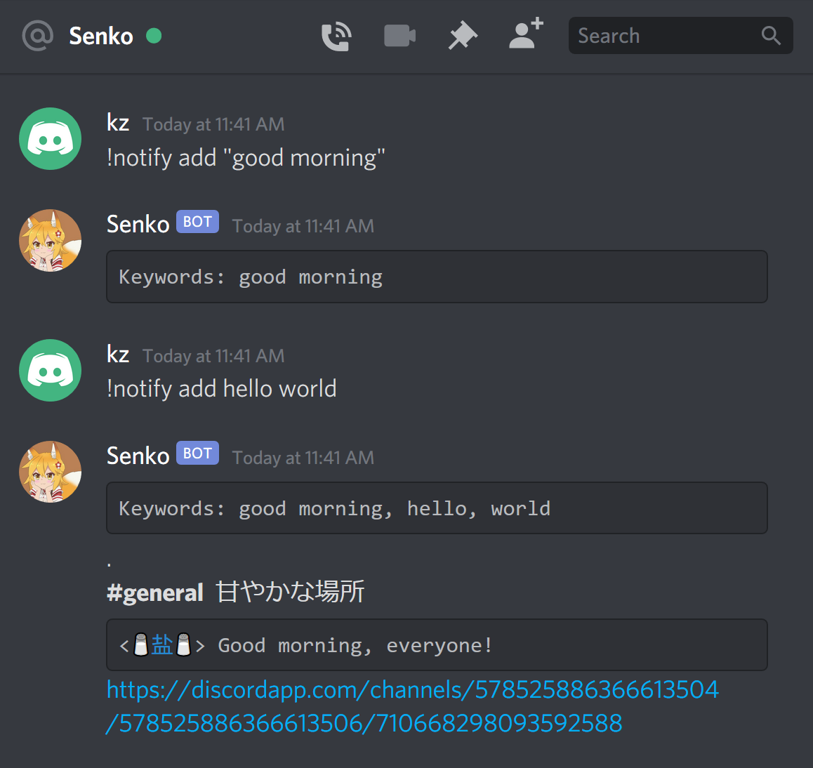

# senko
Discord bot to emulate IRC clients' (also Skype and Slack's) keyword notification feature. 
Senko will DM you the server messages which contain your keywords along with the context and jumplink.
To add Senko to your server, [follow this link](https://discord.com/api/oauth2/authorize?client_id=578444573031006219&permissions=68608&scope=bot).

Keyword commands:
* `!notify add keyword "key words" ...` to add keywords or phrases to be notified for
* `!notify remove keyword "key words" ...` to remove keywords or phrases
* `!notify list` to see the list of all keywords and phrases
* `!notify clear` to remove all keywords and phrases

Other stuff:
* `!roll [max] [min] [num]` to get dice rolls from random.org
* Welcomes you back with `おかえりなのじゃ！` :3
